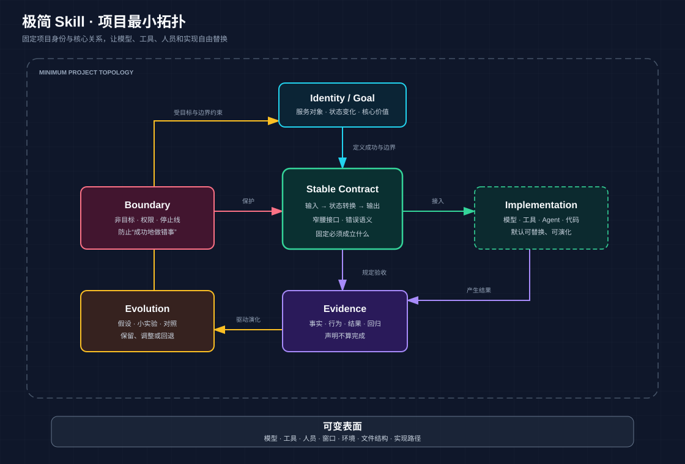

# 极简 Skill · minimal-skill

> 找到复杂项目不可删除的最小关系结构，让工具、模型、人员、窗口和实现方式自由变化，而项目身份与核心能力保持不变。



## “极简”不是少做

极简不是功能少、文件少、Prompt短，也不是把复杂度藏起来。

它指的是：

> **只固定跨环境仍必须成立的目标、边界、契约、证据和演化关系；其余实现默认可替换。**

适合长期、复杂、跨窗口、跨模型、多人协作或持续演化的项目。简单Bug、一次性任务和极简视觉设计不会触发。

## 什么时候调用

```text
启动极简 Skill。
用第一性原则重新梳理这个项目。
帮我找到项目的最小拓扑。
为这个复杂项目建立项目内核／项目守核。
这个项目越来越乱，检查是否目标漂移。
哪些功能和规则可以砍掉？
给工作流建立窄腰结构和中间契约。
升级项目，但不能丢失原来的核心。
建立证据验收和自我升级机制。
换窗口、模型或维护者后仍要能继续。
```

## 四种模式

| 模式 | 用途 | 典型结果 |
|---|---|---|
| `design` | 新建复杂项目 | 最小拓扑、窄腰契约、边界、Gate |
| `audit` | 审计失控项目 | 目标漂移、冗余、旁路、可删除负担 |
| `evolve` | 安全升级项目 | 假设、基准、实验、回归与回退 |
| `handoff` | 跨环境恢复 | 最小状态、关键决策、证据和下一步 |

## 项目最小拓扑

```text
Identity / Goal
      ↓
Boundary
      ↓
Stable Contract ─────→ Replaceable Implementation
      ↑                         ↓
Evolution ←──── Evidence ←──── Result
```

### 不可删除的核心

- **Identity / Goal**：服务谁，要把什么从状态A变成状态B。
- **Boundary**：非目标、权限、停止线和高成本风险。
- **Stable Contract**：输入、状态转换、输出和错误语义。
- **Evidence**：事实、行为、结果与回归证据。
- **Evolution**：假设、小实验、对照、保留或回退。

### 默认可替换的实现

- 模型与供应商
- 工具与Agent
- 代码和目录
- UI和部署方式
- 人员、窗口与执行顺序

只有证据证明某项实现承载项目身份时，它才升级为不变量。

## 核心原则

1. 从状态变化出发，不从功能清单出发。
2. 固定必须成立什么，不固定必须怎样做到。
3. 用窄腰契约连接多变输入与多变实现。
4. 模糊需求先形成可检查的中间契约。
5. 复杂度通过拆分承载，不通过局部堆积承载。
6. 声明不算完成，证据才算完成。
7. 缩小故障域，局部失败、局部修复。
8. 根据目标选择最小充分执行模式。
9. 长期状态外部化，不依赖模型或窗口记忆。
10. 自我升级依靠验证，不是不断添加规则。

## 删除测试

判断一个元素是否属于项目核心：

1. 删除后，项目是否仍服务同一对象？
2. 是否仍产生同一种核心价值变化？
3. 是否仍能判断成功与失败？
4. 是否仍能守住安全、数据和权限边界？
5. 是否仍能跨环境恢复和继续演化？

全部不受影响时，它通常不属于项目身份核心。

## 安装

```bash
git clone https://github.com/xiaogege6697/minimal-skill.git
cp -R minimal-skill ~/.codex/skills/minimal-skill
```

重新开启会话后，可以显式调用 `$minimal-skill`，也可以直接使用上面的自然语言触发。

## 目录

```text
minimal-skill/
├── SKILL.md
├── references/
│   ├── minimum-project-topology.md
│   ├── rule-evolution.md
│   └── templates/project-core-report.md
├── evals/evals.json
└── diagram/minimum-project-topology/
```

## 与相邻工作流的关系

- 极简 Skill：识别、设计、审计项目最小拓扑。
- 领域 Skill：完成漫画、数据库、发布、文档等具体工作。
- 维护胶囊：把已经确认的项目核心和当前状态持久化。

它不取代领域工作流，也不为小任务增加流程税。

## License

[MIT](LICENSE)
